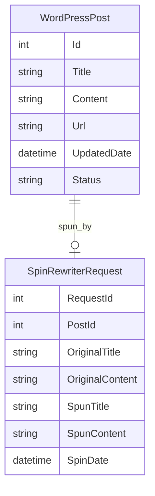

# SpinPost

**SpinPost** is an ASP.NET/C# project designed to automate the process of spinning existing WordPress posts using the Spin Rewriter API, then updating the original post on the same WordPress website with the spun content. This tool is ideal for refreshing old content, improving SEO, and generating unique versions of existing articles directly on your WordPress site.

---

## Features

- **Fetch Posts from WordPress:** Connects to your WordPress site via the REST API to retrieve the post's title and content.
- **Spin/Re-write Content:** Integrates with the Spin Rewriter API to automatically rewrite the post title and content for uniqueness.
- **Update Existing WordPress Posts:** Updates the selected post on the same WordPress website with the spun title and content via the WordPress API.
- **Automated Workflow:** End-to-end automation for fetching, spinning, and updating posts.
- **Error Handling & Logging:** Tracks and logs status and errors for all API communications.

---

## Technologies Used

- **ASP.NET Web Forms / C#:** Core application logic and web interface.
- **WordPress REST API:** For fetching and updating post content.
- **Spin Rewriter API:** For automatic content rewriting.
- **Newtonsoft.Json:** For JSON serialization/deserialization.
- **HttpClient:** For REST API communication.

---

## Typical Workflow

1. **Authenticate:** Configure credentials for WordPress and Spin Rewriter APIs in the application.
2. **Fetch Original Post:** Use the WordPress API to get the post’s current title and content.
3. **Spin Content:** Send the title and content to the Spin Rewriter API and retrieve the spun versions.
4. **Update Post:** Use the WordPress API to update the original post with the spun title and content.
5. **Logging & Status:** Application logs all operations and responses for audit and troubleshooting.

---

## Example Code Snippet

```csharp
// Fetch post from WordPress
using (var client = new HttpClient())
{
    var wpResponse = await client.GetStringAsync("https://yourwp.com/wp-json/wp/v2/posts/POST_ID");
    var post = JsonConvert.DeserializeObject<WordPressPost>(wpResponse);

    // Spin title and content with Spin Rewriter API
    var spinRequest = new { text = post.content.rendered, title = post.title.rendered };
    // Call Spin Rewriter API here and get spunTitle, spunContent...

    // Update the post on WordPress
    var updatedPost = new { title = spunTitle, content = spunContent };
    var wpPutContent = new StringContent(JsonConvert.SerializeObject(updatedPost), Encoding.UTF8, "application/json");
    var wpPutResponse = await client.PutAsync("https://yourwp.com/wp-json/wp/v2/posts/POST_ID", wpPutContent);
}
```

---

## Data Model (ER Diagram Example)



---

## Getting Started

1. Clone the repository.
2. Set up API credentials for WordPress and Spin Rewriter.
3. Configure the source website and credentials in your ASP.NET application settings.
4. Run the application and use the UI to select, spin, and update posts.

---

## License

This project uses open-source libraries (`Newtonsoft.Json`, etc.) and external APIs (WordPress, Spin Rewriter).
See individual library and API documentation for licensing details.

---

## Author

Ashish Saurav

---

## Contributing

Pull requests, feature suggestions, and bug reports are welcome.
